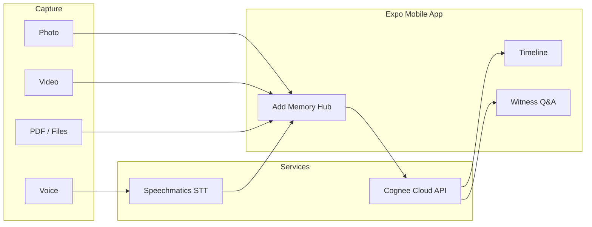

<p align="center">
  <strong>Dear Diary</strong><br/>
  <em>A cinematic memory app — voice, photos, videos & files → Cognee graph</em>
</p>

<p align="center">
  <a href="https://www.wemakedevs.org/hackathons/cognee">WeMakeDevs × Cognee Hackathon</a> ·
  <a href="https://expo.dev/accounts/sahil_bhai/projects/dear-diary">Expo Project</a> ·
  <a href="https://www.cognee.ai/">Cognee Cloud</a> ·
  <a href="https://www.speechmatics.com/">Speechmatics</a>
</p>

---

## What is Dear Diary?

**Dear Diary** is a personal memory app that turns everyday moments into a **searchable knowledge graph**. Speak a thought, snap a photo, attach a video or PDF — Cognee remembers, connects, and lets you **recall patterns** you would otherwise forget.

Built for the **WeMakeDevs Cognee Hackathon** with a focus on the full Cognee memory lifecycle:

| Cognee verb | What users do |
|-------------|---------------|
| `remember()` | Capture voice, photo, video, or document |
| `recall()` | Ask Witness — natural-language graph search |
| `improve()` | Reflect on a memory to strengthen it |
| `forget()` | Reset demo data and re-seed |

---

## Download the APK

Install the latest Android build from Expo:

**https://expo.dev/accounts/sahil_bhai/projects/dear-diary/builds**

Open the link on your phone → tap **Install APK** → allow installs from your browser if prompted.

---

## Features

### Mobile app (primary)

- **Cinematic onboarding** — mirror → focus → shatter intro
- **Multi-media capture** — voice, photo, video, PDF & files
- **Speechmatics STT** — live voice transcription
- **Cognee Cloud** — graph-vector memory storage & recall
- **Timeline** — film-strip view with media-type icons & thumbnails
- **Memory Lab** — visual graph + Cognee verb playground
- **Lenses** — persona views (Designer, Founder, Parent, Memory Keeper)
- **Witness** — ask your graph questions in plain English

### Backend (optional sidecar)

- FastAPI service with Cognee Python SDK
- Multi-step memory agent (parse → plan → retrieve → synthesize)
- Maya demo seed dataset (34 entries)

### Web UI (legacy demo)

- React + Vite cinematic desktop interface

---

## Architecture



---

## Project structure

```
dear-diary/
├── apps/
│   ├── mobile/              # Expo SDK 52 — primary deliverable (APK)
│   │   ├── app/             # Screens (onboarding, dashboard, capture, bloom…)
│   │   ├── components/      # Aurora, FilmStrip, LiquidGlass, GraphCanvas…
│   │   ├── lib/             # cognee.ts, speechmatics.ts, media.ts
│   │   └── BUILD_APK.md     # EAS build guide
│   ├── desktop/             # React web UI (Vite)
│   └── …
├── services/api/            # FastAPI + Cognee sidecar (port 8787)
├── packages/
│   ├── shared/              # TypeScript contracts
│   └── seed/maya/           # Demo diary entries
├── scripts/                 # start-api.ps1, demo-reset.ps1
└── docs/planning/           # Implementation plan & demo script
```

---

## Quick start — Mobile

### 1. Clone & install

```bash
git clone https://github.com/sahil143-dotcom/dear-diary.git
cd dear-diary/apps/mobile
npm install
```

### 2. Environment

```bash
cp .env.example .env
```

| Variable | Purpose |
|----------|---------|
| `EXPO_PUBLIC_SPEECHMATICS_API_KEY` | Voice transcription ([Speechmatics portal](https://portal.speechmatics.com/)) |
| `EXPO_PUBLIC_SPEECHMATICS_REGION` | `eu` / `usa` / `au` |
| `EXPO_PUBLIC_COGNEE_API_URL` | `https://api.cognee.ai` |
| `EXPO_PUBLIC_COGNEE_API_KEY` | [Cognee Cloud](https://platform.cognee.ai/) API key |

> Never commit `.env`. For EAS cloud builds, set these as [EAS environment variables](https://docs.expo.dev/eas/environment-variables/).

### 3. Run locally

```bash
npx expo start
```

Scan the QR code with Expo Go, or press `a` for Android emulator.

### 4. Build APK (EAS)

```bash
npx expo login
npx eas-cli build --platform android --profile preview --non-interactive
```

Full guide: [`apps/mobile/BUILD_APK.md`](./apps/mobile/BUILD_APK.md)

---

## Quick start — API sidecar (optional)

```bash
cp .env.example .env
# Set LLM_API_KEY for local cognify

cd services/api
python -m venv .venv
.venv\Scripts\activate          # Windows
pip install -r requirements.txt
uvicorn main:app --port 8787 --host 127.0.0.1
```

Load demo seed:

```bash
curl -X POST http://127.0.0.1:8787/seed/load -H "Content-Type: application/json" -d "{\"profile\":\"maya-30d\"}"
```

---

## 90-second demo script

1. **Onboarding** — cinematic intro (3 taps)
2. **Dashboard** — read “How it works”, swipe timeline
3. **Add memory** → **Voice** — speak for 10s → Speechmatics transcribes → Cognee saves
4. **Add memory** → **Photo** — pick an image, add a note, save
5. **Witness** — ask *“What do I keep trying and abandoning?”*
6. **Memory Lab** — show graph + `remember / recall / improve / forget` verbs

---

## Tech stack

| Layer | Technology |
|-------|------------|
| Mobile | Expo 52, React Native, Expo Router, Reanimated |
| Voice | Speechmatics REST STT |
| Memory | Cognee Cloud (`remember`, `recall`, `improve`, `forget`) |
| Backend | FastAPI, Cognee Python SDK |
| Web | React 19, Vite, Framer Motion |
| Build | EAS Build → Android APK |

---

## Hackathon alignment

- **Cognee-first** — not generic RAG; full memory verb lifecycle
- **Graph + vector** — hybrid retrieval via Cognee Cloud
- **Multi-modal ingest** — voice + files indexed as graph nodes
- **Agent strip** — visible parse → retrieve → synthesize steps in Witness

Inspired by the [Dear Diary implementation plan](https://github.com/arjun7n9s/Dear-Diary).

---

## Contributing

1. Fork the repo
2. Create a feature branch
3. Keep secrets out of git (use `.env.example` as template)
4. Open a PR

---

## License

Apache-2.0 — see [LICENSE](./LICENSE).

---

<p align="center">
  Built with memory · Powered by <strong>Cognee</strong> + <strong>Speechmatics</strong>
</p>
